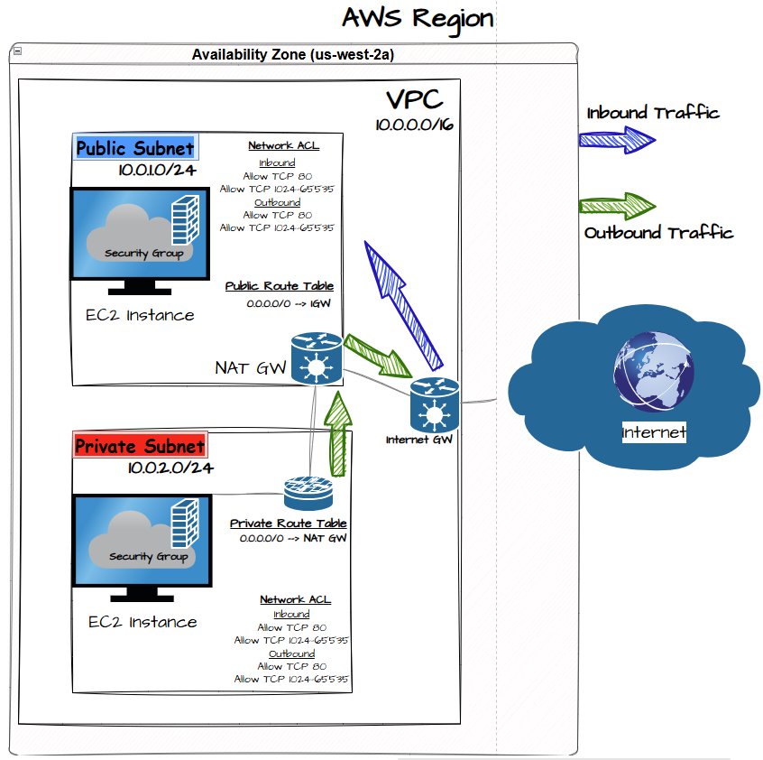

# aws-vpc-secure-infrastructure

This project demonstrates the design and deployment of a segmented AWS cloud network architecture using a VPC, public and private subnets, NAT Gateway, Internet Gateway, route tables, and Network ACL security controls.

The goal was to simulate a secure cloud environment where public-facing services are separated from internal resources while maintaining outbound connectivity.

---

## Architecture Diagram

## Infrastructure Components

VPC
CIDR: 10.0.0.0/16

Public Subnet
10.0.1.0/24
Hosts public resources and NAT Gateway

Private Subnet
10.0.2.0/24
Hosts internal EC2 instances with no direct internet access

Internet Gateway
Provides inbound and outbound internet connectivity for the public subnet

NAT Gateway
Allows private subnet instances to access the internet securely

Route Tables
Public subnet routes internet traffic to the Internet Gateway
Private subnet routes internet traffic through the NAT Gateway

Network ACL
Restricts inbound traffic to HTTP and ephemeral return traffic

## Deployment Steps

1. Created a VPC with CIDR block 10.0.0.0/16

## VPC Creation

   
3. Created two subnets:
   - Public Subnet: 10.0.1.0/24
   - Private Subnet: 10.0.2.0/24

## Subnet Creation

4. Attached an Internet Gateway to the VPC

5. Created a NAT Gateway in the public subnet

6. Configured route tables:
   Public Route Table
   0.0.0.0/0 → Internet Gateway

   Private Route Table
   0.0.0.0/0 → NAT Gateway

7. Configured Network ACL rules to allow HTTP traffic and ephemeral return ports

8. Launched EC2 instances in both subnets for connectivity testing

## Testing and Validation

Public EC2 Instance
- Verified inbound HTTP connectivity from internet
- Confirmed instance is reachable through Internet Gateway

Private EC2 Instance
- Confirmed instance cannot be accessed directly from the internet
- Verified outbound connectivity using NAT Gateway

## Troubleshooting

Issue:
Private EC2 instance could not access external websites.

Cause:
Private subnet route table was missing NAT Gateway route.

Solution:
Updated route table:

0.0.0.0/0 → NAT Gateway

Result:
Outbound internet connectivity restored.
